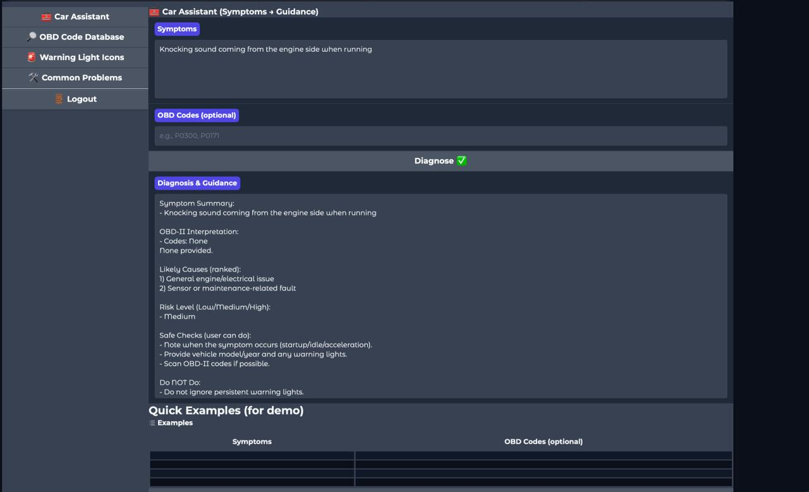
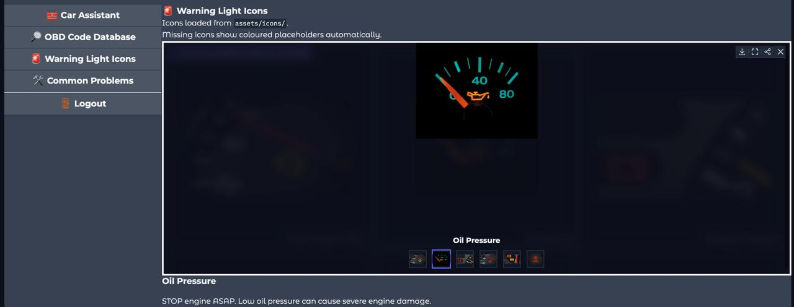

# 🚗 Car Diagnostic Assistant LLM


An AI-powered automotive diagnostic assistant built using **Microsoft Phi-2**, **LoRA (Low-Rank Adaptation)** fine-tuning, and **Gradio**. The system assists users by analyzing vehicle symptoms and OBD-II fault codes to generate structured diagnostic recommendations.

---

# 📖 Overview

Car owners often struggle to interpret vehicle symptoms and OBD-II trouble codes without consulting a mechanic. This project aims to bridge that gap by providing an intelligent diagnostic assistant capable of:

* Understanding vehicle symptoms described in natural language.
* Interpreting OBD-II fault codes.
* Suggesting likely causes.
* Assessing risk levels.
* Recommending safe checks and next actions.

The assistant combines a fine-tuned Large Language Model with curated automotive diagnostic knowledge to provide practical and easy-to-understand diagnostic guidance.

---

# ✨ Features

### 🔍 Symptom-Based Diagnosis

Analyze user-reported vehicle issues such as:

* Rough idling
* Engine vibration
* Hard starting
* Overheating
* Brake issues
* Electrical problems
* Transmission concerns

### 🛠 OBD-II Code Interpretation

Supports automotive fault code analysis including:

* P0300 – Random Misfire
* P0301 – Cylinder 1 Misfire
* P0302 – Cylinder 2 Misfire
* P0303 – Cylinder 3 Misfire
* P0304 – Cylinder 4 Misfire

and other diagnostic codes available through the integrated OBD database.

### 📊 Structured Diagnostic Reports

Generates outputs in a mechanic-friendly format:

* Symptom Summary
* OBD-II Interpretation
* Likely Causes
* Risk Level
* Safe Checks
* Do Not Do
* Next Action

### 🤖 Fine-Tuned LLM

Built using:

* Microsoft Phi-2
* PEFT LoRA fine-tuning
* Hugging Face Transformers
* PyTorch

### 💻 User-Friendly Interface

Interactive web application powered by Gradio.

---

# 🏗 System Architecture

```text
User Symptoms
       +
   OBD Codes
       │
       ▼
 OBD Interpreter
       │
       ▼
 Prompt Builder
       │
       ▼
 Microsoft Phi-2
       +
  LoRA Adapter
       │
       ▼
 Output Validation
       │
       ▼
 Diagnostic Report
```

---

# 🧠 Model Information

| Component          | Details                                |
| ------------------ | -------------------------------------- |
| Base Model         | Microsoft Phi-2                        |
| Fine-Tuning Method | LoRA (PEFT)                            |
| Framework          | Hugging Face Transformers              |
| Training Dataset   | Custom Automotive Diagnostic Dataset   |
| Inference Engine   | PyTorch                                |
| Interface          | Gradio                                 |
| Platform           | macOS Apple Silicon / Local Deployment |

---

# 📂 Project Structure

```text
CAR_ASSISTANT/

├── assets/
│   ├── icons/
│   └── screenshots/
│
├── data/
│   ├── train.jsonl
│   └── obd-trouble-codes.csv
│
├── models/
│   └── car-assistant-qlora/
│
├── notebooks/
│   └── finetuning.ipynb
│
├── scripts/
│   ├── test_load.py
│   └── colab_parity_test.py
│
├── src/
│   ├── config.py
│   ├── model_loader.py
│   ├── obd_utils.py
│   ├── diagnosis.py
│   └── ui.py
│
├── app.py
├── requirements.txt
├── README.md
└── LICENSE
```

---

# ⚙️ Installation

## Clone Repository

```bash
git clone https://github.com/YOUR_USERNAME/Car_Assistant_LLM.git

cd Car_Assistant_LLM
```

## Create Virtual Environment

```bash
python -m venv venv

source venv/bin/activate
```

Windows:

```bash
venv\Scripts\activate
```

## Install Dependencies

```bash
pip install -r requirements.txt
```

---

# 🚀 Running the Application

Launch the Gradio application:

```bash
python app.py
```

The application will be available locally at:

```text
http://127.0.0.1:7860
```

---

# 🧪 Model Verification

To verify that:

* Phi-2 loads correctly
* LoRA adapter loads correctly
* Tokenizer is configured correctly
* Inference works successfully

run:

```bash
python scripts/test_load.py
```

---

# 📸 Screenshots

## Home Interface

*Add screenshot here*

```markdown

```

## warnings Example

*Add screenshot here*

```markdown

```


---

# 📈 Example Output

```text
Symptom Summary:
- Strong fuel smell and engine vibration

OBD-II Interpretation:
- P0302: Cylinder 2 Misfire Detected

Likely Causes:
1. Faulty spark plug
2. Ignition coil issue
3. Fuel injector problem

Risk Level:
High

Safe Checks:
- Inspect spark plugs
- Check ignition connections

Do Not Do:
- Avoid prolonged driving

Next Action:
- Schedule engine diagnostic service
```

---

# ⚠️ Limitations

This project is intended for educational and research purposes.

* Not a substitute for professional vehicle diagnostics.
* Diagnostic recommendations are AI-generated and may not always be accurate.
* Supports a limited set of training scenarios and OBD fault patterns.
* Performance depends on the quality and completeness of user-provided information.

---

# 🔮 Future Improvements

* Expanded OBD-II code coverage
* Larger automotive training dataset
* Retrieval-Augmented Generation (RAG)
* Multi-turn conversational diagnostics
* Vehicle-specific recommendations
* Enhanced confidence scoring

---

# 👨‍💻 Project Team

### Team Members

* Pranav M Nair
* Aadil Sandeep
* Advaith S Vinod
* Thejas Baiju

---

# 🎓 Academic Context

This project was developed as an academic and research-oriented exploration of:

* Automotive Artificial Intelligence
* Large Language Models
* Parameter-Efficient Fine-Tuning (PEFT)
* OBD-II Diagnostic Systems
* Intelligent Vehicle Assistance Systems

---

# 📜 License

This project is licensed under the MIT License.

See the `LICENSE` file for details.

---

# 🙏 Acknowledgements

* Microsoft Research for the Phi-2 model
* Hugging Face Transformers
* PEFT (Parameter-Efficient Fine-Tuning)
* PyTorch
* Gradio

---

**Built with AI, Machine Learning, and Automotive Diagnostics in mind.**
